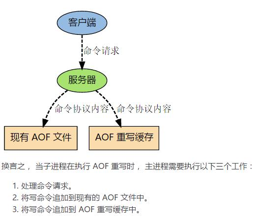

#### 说明

[spring-boot-redis-demo](https://github.com/TinyDataLiu/redis-demos/tree/master/spring-boot-redis-demo)

> spring boot 操作Redis

# Redis为什么这快

1. 纯内存结构：KV 结构的内存数据库，时间复杂度 O(1)
2. 单线程：
   * 没有创建线程、销毁线程带来的消耗
   * 避免了上线文切换导致的 CPU 消耗
   * 避免了线程之间带来的竞争问题，例如加锁释放锁死锁等等
3. 多路复用
   * 异步非阻塞 I/O，多路复用处理并发连接

# 内存回收

Reids所有的数据都是存储在内存中的，在某些情况下需要对占用的内存空间进行回收。内存回收主要分为两类，一类是key过期，一类是内存使用达到上限（max_memory）触发内存淘汰。

#### 过期策略

要实现 key 过期，我们有几种思路。

##### 定时过期（主动 ）淘汰

每个设置过期时间的key都需要创建一个定时器，到过期时间就会立即清除。该策略可以立即清除过期的数据，对内存很友好；但是会占用大量的CPU资源去处理过期的数据，从而影响缓存的响应时间和吞吐量。

##### 惰性过期（被动 ）淘汰

只有当访问一个 key 时，才会判断该 key 是否已过期，过期则清除。该策略可以最大化地节省 CPU 资源，却对内存非常不友好。极端情况可能出现大量的过期 key 没有再次被访问，从而不会被清除，占用大量内存。

##### 定期过期

每隔一定的时间，会扫描一定数量的数据库的 expires 字典中一定数量的 key，并清除其中已过期的 key。该策略是前两者的一个折中方案。通过调整定时扫描的时间间隔和每次扫描的限定耗时，可以在不同情况下使得 CPU 和内存资源达到最优的平衡效果。

**Redis 中同时使用了惰性过期和定期过期两种过期策略**

#### 淘汰策略

Redis的内存淘汰策略，是指当内存使用达到最大内存极限时，需要使用淘汰算法来决定清理掉哪些数据，以保证新数据的存入。

##### 最大内存设置

```properties
# 如果不设置maxmemory或者设置为0，64位系统不限制内存，32位系统最多使用3GB内存
maxmemory 2GB
```

##### 动态修改

```sh
redis> config set maxmemory 2GB
```

##### 淘汰策略

```properties
# 根据LRU算法删除设置了超时属性（expire）的键，直到腾出足够内存为止。如果没有可删除的键对象，回退到noeviction策略。
# volatile-lru -> Evict using approximated LRU among the keys with an expire set.
# 根据 LRU 算法删除键，不管数据有没有设置超时属性，直到腾出足够内存为止。
# allkeys-lru -> Evict any key using approximated LRU.
# 在带有过期时间的键中选择最不常用的。
# volatile-lfu -> Evict using approximated LFU among the keys with an expire set.
# 在所有的键中选择最不常用的，不管数据有没有设置超时属性。
# allkeys-lfu -> Evict any key using approximated LFU.
# 在带有过期时间的键中随机选择
# volatile-random -> Remove a random key among the ones with an expire set.
# 随机删除所有键，直到腾出足够内存为止。
# allkeys-random -> Remove a random key, any key.
# 根据键值对象的 ttl 属性，删除最近将要过期数据。如果没有，回退到 noeviction 策略。
# volatile-ttl -> Remove the key with the nearest expire time (minor TTL)
# 默认策略，不会删除任何数据，拒绝所有写入操作并返回客户端错误信息（error）OOM
# command not allowed when used memory，此时 Redis 只响应读操作。
# noeviction -> Don't evict anything, just return an error on write operations.
maxmemory-policy noeviction
```

<font color=red>如果没有符合前提条件的key被淘汰，那么volatile-lru、volatile-random、volatile-ttl相当于noeviction（不做内存回收）。</font>

```sh
# 动态修改淘汰策略
redis> config set maxmemory-policy volatile-lru
```

建议使用 volatile-lru，在保证正常服务的情况下，优先删除最近最少使用的 key。

# 持久化机制

Redis 速度快，很大一部分原因是因为它所有的数据都存储在内存中。如果断电或者宕机，都会导致内存中的数据丢失。为了实现重启后数据不丢失，Redis 提供了两种持久化的方案，一种是 RDB 快照（Redis DataBase），一种是 AOF（Append Only File）。

##### RDB

RDB是Redis默认的持久化方案。当满足一定条件的时候，会把当前内存中的数据写入磁盘，生成一个快照文件dump.rdb。Redis重启会通过加载dump.rdb文件恢复数据。

##### 触发机制

```properties
################################ SNAPSHOTTING  ################################
# Save the DB on disk:
#   save <seconds> <changes>
#	只要满足任意一个都会触发。
#   save ""
# 900 秒内至少有一个 key 被修改（包括添加）
save 900 1 
# 400 秒内至少有 10 个 key 被修改
save 300 10
# 60 秒内至少有 10000 个 key 被修改
save 60 10000
# RDB文件名称 The filename where to dump the DB
dbfilename "dump.rdb"
# The working directory.
#
# The DB will be written inside this directory, with the filename specified
# above using the 'dbfilename' configuration directive.
#
# The Append Only File will also be created inside this directory.
#
# Note that you must specify a directory here, not a file name.
dir "/usr/local/soft/redis-5.0.5/src"
# 是否是 LZF 压缩 rdb 文件 开启压缩可以节省存储空间，但是会消耗一些CPU的计算时间，默认开启
rdbcompression yes
# 开启数据校验
# 使用 CRC64 算法来进行数据校验，但是这样做会增加大约 10%的性能消耗，如果希望获取到最
# 大的性能提升，可以关闭此功能。
rdbchecksum yes
```

##### 手动触发

如果我们需要重启服务或者迁移数据，这个时候就需要手动触RDB快照保存。Redis提供了两条命令：

```sh
# 1. 使用save 命令
# save在生成快照的时候会阻塞当前Redis服务器，Redis不能处理其他命令。如果内存中的数据比较多，会造成Redis长时间的阻塞。生# 产环境不建议使用这个命令。
127.0.0.1:6379> SAVE
# 2. bgsave
# 执行bgsave时，Redis会在后台异步进行快照操作，快照同时还可以响应客户端请求。
# 具体操作是Redis进程执行fork操作创建子进程（copy-on-write），RDB持久化
# 过程由子进程负责，完成后自动结束。它不会记录fork之后后续的命令。阻塞只发生在fork阶段，一般时间很短。
127.0.0.1:6379> BGSAVE
Background saving started
# 用lastsave命令可以查看最近一次成功生成快照的时间。
127.0.0.1:6379> LASTSAVE
(integer) 1585908050
```

#####  RDB文件的优势和劣势

##### 优势

1. RDB是一个非常紧凑(compact)的文件，它保存了redis在某个时间点上的数据集。这种文件非常适合用于进行备份和灾难恢复。
2. 生成RDB文件的时候，redis主进程会<font color=red>fork()</font>一个子进程来处理所有保存工作，主进程不需要进行任何磁盘IO操作。
3. RDB 在恢复大数据集时的速度比 AOF 的恢复速度要快。

##### 劣势

1. RDB方式数据没办法做到实时持久化/秒级持久化。因为bgsave每次运行都要执行fork操作创建子进程，频繁执行成本过高。
2. 在一定间隔时间做一次备份，所以如果redis意外down掉的话，就会丢失最后一次快照之后的所有修改（数据有丢失）。

<font color=red>如果数据相对来说比较重要，希望将损失降到最小，则可以使用AOF方式进行持久化。</font>

##### AOF:Append Only File

Redis默认不开启。AOF采用日志的形式来记录每个写操作，并追加到文件中。开启后，执行更改Redis数据的命令时，就会把命令写入到AOF文件中。Redis重启时会根据日志文件的内容把写指令从前到后执行一次以完成数据的恢复工作。

##### AOF配置

```properties
# Please check http://redis.io/topics/persistence for more information.
# Redis 默认只开启 RDB 持久化，开启 AOF 需要修改为 yes
appendonly yes
# The name of the append only file (default: "appendonly.aof")
# 路径也是通过 dir 参数配置 config get dir
appendfilename "appendonly.aof"
# 持久化策略（硬盘缓存到磁盘），默认 everysec
# no 表示不执行 fsync，由操作系统保证数据同步到磁盘，速度最快，但是不太安全
# always 表示每次写入都执行fsync，以保证数据同步到磁盘，效率很低；
# everysec表示每秒执行一次fsync，可能会导致丢失这1s数据。通常选择everysec，兼顾安全性和效率。
appendfsync everysec
```

由于操作系统的缓存机制，AOF数据并没有真正地写入硬盘，而是进入了系统的硬盘缓存。什么时候把缓冲区的内容写入到AOF文件`appendfsync` 决定

##### 文件越来越大怎么办

由于 AOF 持久化是 Redis 不断将写命令记录到 AOF 文件中，随着 Redis 不断的进行，AOF 的文件会越来越大，文件越大，占用服务器内存越大以及 AOF 恢复要求时间越长。例如 set gupao 666，执行 1000 次，结果都是 gupao=666。为了解决这个问题，Redis 新增了重写机制，当 AOF 文件的大小超过所设定的阈值时，Redis 就会启动 AOF 文件的内容压缩，只保留可以恢复数据的最小指令集。可以使用命令 bgrewriteaof 来重写。AOF 文件重写并不是对原文件进行重新整理，而是直接读取服务器现有的键值对，然后用一条命令去代替之前记录这个键值对的多条命令，生成一个新的文件后去替换原来的 AOF 文件。

```sh
# 1.命令方式执行REWRITE
127.0.0.1:6379> BGREWRITEAOF
Background append only file rewriting started
```

##### AOF REWRITE 触发配置

```properties
# 默认值为 100。aof 自动重写配置，当目前 aof 文件大小超过上一次重写的 aof 文件大小的
# 百分之多少进行重写，即当 aof 文件增长到一定大小的时候，Redis 能够调用 bgrewriteaof
# 对日志文件进行重写。当前 AOF 文件大小是上次日志重写得到 AOF 文件大小的二倍（设
# 置为 100）时，自动启动新的日志重写过程。
auto-aof-rewrite-percentage 100
# 默认 64M。设置允许重写的最小 aof 文件大小，避免了达到约定百分比但尺寸仍然很小的情况还要重写。
auto-aof-rewrite-min-size 64mb
# 在 aof 重写或者写入 rdb 文件的时候，会执行大量 IO，此时对于 everysec 和 always 的 aof
# 模式来说，执行 fsync 会造成阻塞过长时间，no-appendfsync-on-rewrite 字段设置为默认设
# 置为 no。如果对延迟要求很高的应用，这个字段可以设置为 yes，否则还是设置为 no，这
# 样对持久化特性来说这是更安全的选择。设置为 yes 表示 rewrite 期间对新写操作不 fsync,
# 暂时存在内存中,等 rewrite 完成后再写入，默认为 no，建议修改为 yes。Linux 的默认 fsync
# 策略是 30 秒。可能丢失30秒数据。
no-appendfsync-on-rewrite no
# aof 文件可能在尾部是不完整的，当 redis 启动的时候，aof 文件的数据被载入内存。重启
# 可能发生在 redis所在的主机操作系统宕机后，尤其在ext4文件系统没有加上data=ordered
# 选项，出现这种现象。redis 宕机或者异常终止不会造成尾部不完整现象，可以选择让 redis
# 退出，或者导入尽可能多的数据。如果选择的是 yes，当截断的 aof 文件被导入的时候，
# 会自动发布一个 log 给客户端然后 load。如果是 no，用户必须手动 redis-check-aof 修复 AOF
# 文件才可以。默认值为 yes。
aof-load-truncated yes
```

##### 重写过程中，AOF文件被更改了怎么办



##### AOF数据恢复

##### 优点

1. AOF持久化的方法提供了多种的同步频率，即使使用默认的同步频率每秒同步一次，Redis最多也就丢失1秒的数据而已。

##### 缺点

1. 对于具有相同数据的的Redis，AOF文件通常会比RDF文件体积更大（RDB存的是数据快照）。
2. 虽然AOF提供了多种同步的频率，默认情况下，每秒同步一次的频率也具有较高的性能。在高并发的情况下，RDB比AOF具好更好的性能保证。

##### 两种方案比较

那么对于 AOF 和 RDB 两种持久化方式，我们应该如何选择呢？

如果可以忍受一小段时间内数据的丢失，毫无疑问使用RDB是最好的，定时生成RDB快照（snapshot）非常便于进行数据库备份，并且RDB恢复数据集的速度也要比AOF恢复的速度要快。否则就使用AOF重写。但是一般情况下建议不要单独使用某一种持久化机制，而是应该两种一起用，在这种情况下,当redis重启的时候会优先载入AOF文件来恢复原始的数据，因为在通常情况下AOF文件保存的数据集要比RDB文件保存的数据集要完整。